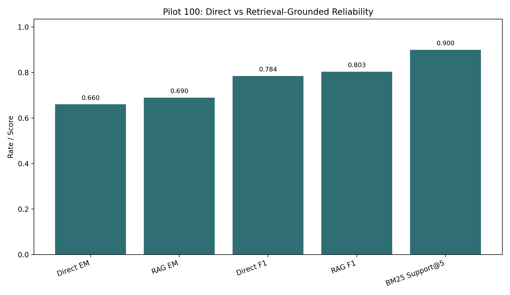
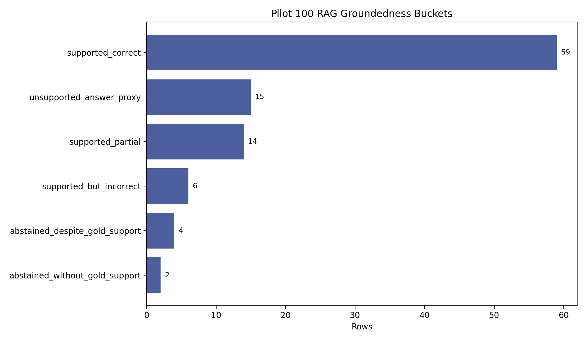
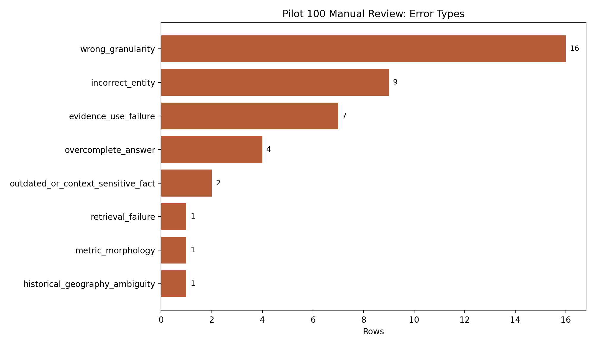

# LLM FactCheck: Reliability Evaluation for Factual Question Answering

## Abstract

Large language models can answer factual questions fluently, but fluent responses are not always reliable. This project builds a reproducible evaluation framework for factual question answering that compares direct LLM answering, retrieval-only evidence search, and retrieval-grounded LLM answering. The pilot study uses a 100-question TriviaQA benchmark subset and evaluates systems with exact match, normalized exact match, token F1, retrieval support, groundedness proxies, and manual error review. On the pilot benchmark, retrieval-grounded generation improved normalized exact match from 0.66 to 0.69 and mean token F1 from 0.784048 to 0.803024 compared with direct prompting. However, manual review and groundedness analysis show that retrieval does not automatically guarantee reliability: the RAG system sometimes refused despite available evidence, selected an incorrect entity from retrieved text, or returned over-complete answers.

## Research Question

The central research question is:

Under what conditions can an LLM be trusted for factual question answering, and how much does retrieval grounding improve reliability compared with direct prompting alone?

The project focuses on reliability rather than only average accuracy. A system is more reliable if it returns correct short answers, uses retrieved evidence appropriately, avoids unsupported claims, and exposes failure modes that can be inspected and improved.

## Dataset

The pilot benchmark uses TriviaQA because it provides factual question-answer pairs with answer aliases and evidence-like context fields. The current benchmark contains 100 questions selected for a first controlled experiment. Each row includes a question ID, question text, primary gold answer, answer aliases, normalized answer fields, and available evidence contexts.

The benchmark file is:

`data/benchmark/triviaqa_pilot_v1.csv`

This project currently uses one dataset intentionally. Adding Natural Questions or another dataset is a future extension after the TriviaQA pipeline is stable and interpretable.

## System Variants

Three system settings are compared.

1. Direct LLM baseline

The direct baseline prompts the LLM to answer the factual question using only its internal knowledge. This tests how reliable the model is without external grounding.

2. BM25 retrieval baseline

The BM25 baseline retrieves the top 5 evidence chunks from the available TriviaQA contexts. This does not generate a final natural language answer. Instead, it tests whether answer-supporting evidence exists in the retrieved passages.

3. BM25-grounded RAG baseline

The RAG baseline gives the LLM the top 5 BM25 passages and asks it to answer using only that evidence. If the evidence is insufficient, the model is instructed to return `INSUFFICIENT_EVIDENCE`.

## Evaluation Methods

The project combines automated metrics with manual review.

Automated correctness metrics:

- Exact Match: checks whether the predicted answer exactly matches a gold answer.
- Normalized Exact Match: applies lowercasing, punctuation removal, article removal, and whitespace cleanup before matching.
- Token F1: measures overlap between prediction tokens and gold answer tokens.
- Correctness Label: classifies answers as correct, partially correct, or incorrect.
- Risk Label: maps correctness into low, medium, or high risk.

Retrieval and groundedness metrics:

- BM25 Support@5: whether the gold answer appears in the top 5 retrieved passages.
- Answer Support Rate: whether the RAG answer string appears in retrieved evidence.
- Unsupported Answer Proxy: whether a non-empty, non-abstention RAG answer does not lexically appear in the retrieved evidence.
- Refusal Despite Gold Support: whether RAG returns `INSUFFICIENT_EVIDENCE` even though BM25 retrieved a passage containing the gold answer.

Manual review:

Rows were flagged for review when direct and RAG differed, when either system was not correct, or when the comparison outcome required interpretation. The final manual review file contains 41 reviewed rows, all marked `human_verified`.

## Main Results

| System | Normalized EM | Mean Token F1 | Support@5 |
|---|---:|---:|---:|
| Direct LLM | 0.660 | 0.784 | |
| BM25 Retrieval | | | 0.900 |
| BM25 + RAG | 0.690 | 0.803 | |

Retrieval grounding produced a modest improvement over direct prompting. RAG improved normalized exact match by 3.0 percentage points and mean token F1 by 0.018976. BM25 retrieved answer-supporting evidence in 90% of the benchmark rows, which suggests that the retrieval layer often found useful context.

The improvement was real but not dramatic. RAG fixed 10 direct failures and improved 2 additional cases to partial correctness. At the same time, RAG regressed 9 cases, showing that adding evidence does not automatically make the answer generator more reliable.

## Groundedness Analysis

The groundedness proxy checks whether the generated RAG answer appears in the retrieved evidence. This is a conservative lexical proxy, not a full factuality judgment. It can miss paraphrases and may count misleading lexical overlap as support.

Groundedness results:

- Gold answer support@5: 90.0%
- RAG answer support rate across all rows: 79.0%
- RAG answer support rate among answered rows: 84.0%
- Unsupported-answer proxy rate: 15.0%
- Refusal despite gold support: 4 rows
- Supported but incorrect: 6 rows

These results show that retrieval and generation fail in different ways. In many cases, BM25 retrieved useful evidence, but the RAG model still selected the wrong answer, returned too much information, or refused to answer despite evidence being present.

## Manual Error Analysis

The final manual review contains 41 rows. The most common error type was wrong granularity, with 16 rows. This means the answer was close but too broad, too specific, or phrased at a different level than the benchmark expected.

Manual review error counts:

- Wrong granularity: 16
- Incorrect entity: 9
- Evidence use failure: 7
- Over-complete answer: 4
- Outdated or context-sensitive fact: 2
- Retrieval failure: 1
- Metric morphology issue: 1
- Historical geography ambiguity: 1

Manual review labels:

- Both wrong: 10
- Ambiguous partial: 9
- Direct partial, RAG correct: 6
- Direct correct, RAG wrong: 5
- Direct correct, RAG partial: 4
- Direct wrong, RAG correct: 4
- Direct wrong, RAG partial: 2
- Metric artifact: 1

The manual review supports the main finding: retrieval helps, but reliability depends on how the model uses the evidence. The strongest failure pattern is not simply missing evidence. Instead, failures often come from answer granularity, incorrect entity selection, or using evidence poorly.

## Discussion

The pilot results suggest that retrieval grounding improves factual QA reliability, but only modestly in the current setup. Direct prompting already performs well on some common factual questions. RAG improves performance when the direct model lacks knowledge or when the retrieved evidence clearly contains the benchmark answer. However, RAG can regress when retrieved passages contain multiple plausible entities, when the prompt encourages excessive caution, or when the benchmark expects a shorter answer than the model returns.

The BM25 support result is important. Since the gold answer appeared in the retrieved top 5 passages for 90% of rows, the retrieval component is not the main bottleneck in most cases. The harder problem is evidence use: selecting the correct answer from retrieved text and returning it at the right level of specificity.

The manual review also shows why average accuracy alone is insufficient. A row can be automatically marked partial because of wording, plurality, or answer granularity, even if the response would be acceptable to a human. Conversely, a generated answer can appear in retrieved evidence but still be wrong because the passage contains distractor entities.

## Limitations

The benchmark is currently small. A 100-question pilot is enough to validate the framework and identify failure modes, but it is not enough for broad claims about all factual QA.

The groundedness metric is lexical. It checks whether answer strings appear in retrieved evidence, not whether the answer is truly entailed by the evidence. A stronger future version should use human labels or an entailment model.

The project currently uses one dataset. TriviaQA is useful for a pilot, but results may differ on Natural Questions or domain-specific datasets.

The current RAG system uses BM25 retrieval. BM25 is interpretable and strong enough for a baseline, but dense retrieval or hybrid retrieval may improve evidence quality.

The LLM is treated mostly as a black-box answer generator. Future work could test multiple models, prompting strategies, confidence calibration, and abstention behavior.

## Future Work

The next phase should focus on four improvements.

1. Scale the benchmark beyond 100 questions while preserving manual-review feasibility.
2. Add stronger groundedness scoring, such as entailment-based evidence support or human-labeled evidence sufficiency.
3. Compare BM25 with dense retrieval or hybrid retrieval.
4. Build a lightweight dashboard that lets users inspect each question, direct answer, RAG answer, evidence passages, correctness label, groundedness label, and manual-review category.

## Conclusion

This project built a working reliability evaluation framework for factual question answering. The framework goes beyond average accuracy by comparing direct answering, retrieval, RAG, evidence support, groundedness proxies, and manually verified failure categories. The first 100-question TriviaQA pilot shows that retrieval grounding improves performance, but the gain is modest and not automatic. The main reliability challenge is not only retrieving evidence; it is using that evidence correctly, returning the right answer granularity, and knowing when to abstain.

